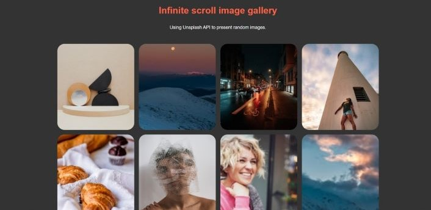

# **Infinite scroll image gallery**
## Live preview: https://unsplash-images-63f54.web.app/

Using Unsplash API to present random images, using: \
⚡️ React JS, Unsplash API , CSS, HTML ⚡️



### Setup & Run
- Clone or download this repository https://github.com/sharonNissanov/Infinite-scroll-image-gallery-
- Move to the wanted folder: ```cd using_api```
- Install dependencies: in cmd run ```npm install``` 
- Run the app in the development mode: in cmd run ```npm start```\
Open [http://localhost:3000](http://localhost:3000) to view it in the browser.\
The page will reload if you make edits.\
You will also see any lint errors in the console. 

Enjoy 😊